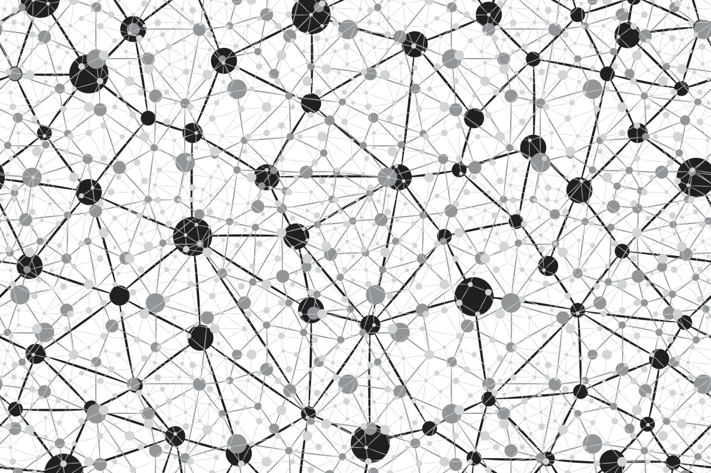

# Neural Networks
Tutorials on Convolutional and Recurrent Neural Networks with PyTorch and Keras. CNN are mainly used for image recognition and time sequences studies, and RNN are the basics for Natural Language Processing.

-File 1 is a theoretical explanation on Convolutional Neural Networks (CNN).
-In files 2 and 3 we apply this structur for predicting MNIST handwritten numbers, with Pytorch and Keras respectivly.
-File 4 is for CNN with time series, developed using Keras.
-Fle 5 is a theoretical explanation on Recurrent Neual Networks (RNN).
-In file 6 we develop a simple RNN for Natural Language Processing using PyTorch.

